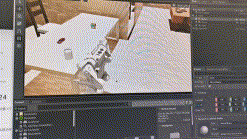

# CRAIC2024
人形机器人创新挑战赛  BIT-LINC队伍方案

## 学习计划
单纯就比赛来说，提交`submission`即可，里面包括具体的`vel cmd`以及自己实现的controller（可以考虑用强化学习）。此外，tongverselite的实现被官方做了assets为主的加密，可以参考`docs/dev-branch-copy`来简单理解框架逻辑。

## 安装指南
下载官方镜像并且构建容器,建议使用linux原生机器、或者尝试服务器，不要用windows上的docker服务来做(目前不支持vulkan)
```sh
git clone https://github.com/superboySB/BipedChallenge && cd ./BipedChallenge

docker build -t superboysb/bipedchallenge:20240314 .

# wget https://roban.lejurobot.com/humanoid-tongverselite/tongverselite-release-docker_20240104.tar.gz

# md5sum -c checksum.txt

# docker load -i tongverselite-release-docker_20240104.tar.gz

bash docker-run-release.sh
```
如果出现转码问题，可以用`dos2unix docker-run-release.sh`转换编码,先尝试用虚拟机的思路来使用容器
```sh
docker exec -it bipedchallenge /bin/bash
```
尝试运行demo，task从1-6指定。
```sh
bash examples/launch_task.sh <task-id>
```
如果出现转码问题，可以用`dos2unix examples/launch_task.sh`转换编码。注意目前这个工程暂时不支持headless模式（大概率是学艺不精），亲测需要使用ubuntu+RTX的台式机（需要插屏幕）来运行代码,否则会有奇怪问题。如果有类似`Failed to acquire IWindowing interface`的错误可以设置`export DISPLAY=:0`



## 训练
这玩意不训练controller不行呀，还是需要训练，如果遇到nucleus的问题可能需要初步联网、并且插一个屏幕
```sh
bash xxx
```
## 运行our solution
很显然solution将不卡随机种子，需要泛化性策略
```sh
bash solution/launch_task.sh <task-id>
```

## Useful Tips
对于example文件来说，维护行为树(task 1-5)，可以压缩和解压文件，会导致原始文件被删除，比赛官方提供的标注为`example`
```sh
gzip -c task{id}_cmd.json > task{id}_cmd.json.gz   # 压缩

# gunzip task_{id}_cmd.json,gz # 解压(用于还原检查完整性)
```

