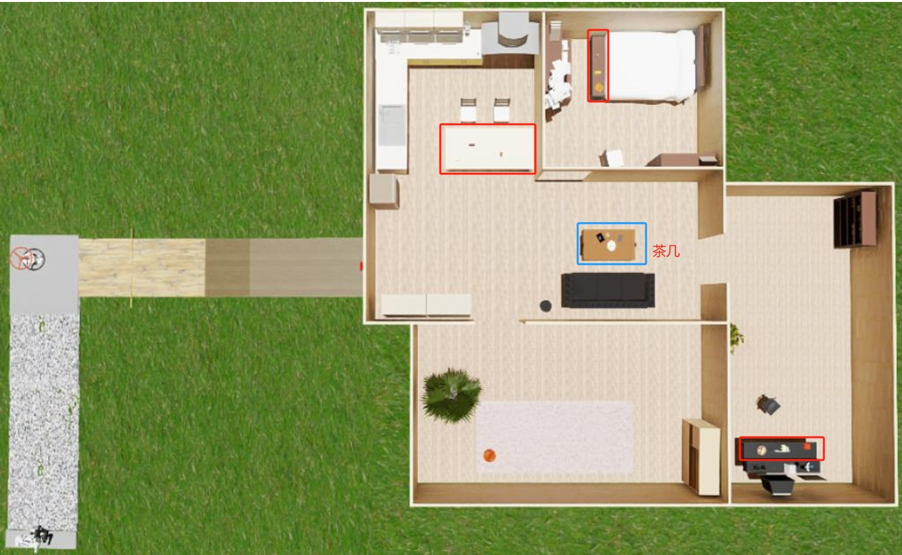

# 第六关

## 关卡物品说明

杯子       - coffee_mug

红色轿车   - Red_Sedan

玩具电视   - Toy_Television

玩具熊     - teddy_bear

黄色小车   - Yellow_Toy_Car

饮料       - Beverage

红色积木   - red_cube

一把香蕉   - Bunch_of_Bananas

果盘       - Fruit_Platter

餐厅       - Dining_Room

卧室       - Bedroom

游戏室     - Game_Room

示例: "Please put the \<xxx\> on the coffee table."

## 关卡区域说明

红色：每个关卡的任务平台
蓝色：放置任务物品的茶几(coffee table)

